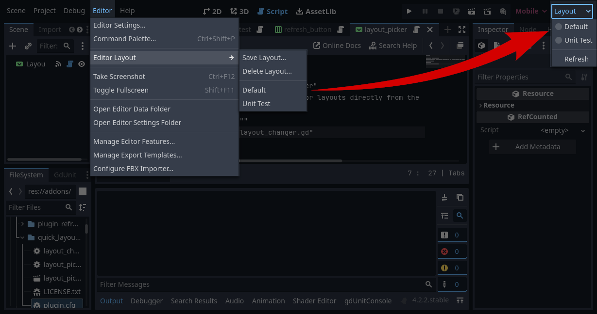

This is a simple Godot 4 editor plugin to change editor layouts
directly from the toolbar, without going through the
Editor->Layouts->... menu.

**WARNING**: This plugin is horribly hacky and relies on a lot of
internal details of how the editor works, since there's no official
API that would allow access to saved layouts. According to my testing
it _should_ work on 4.2, and _should_ work for languages other than
English. However, I can't guarantee it. If you run into problems,
please open an issue, and I'll try to fix it if I can.
